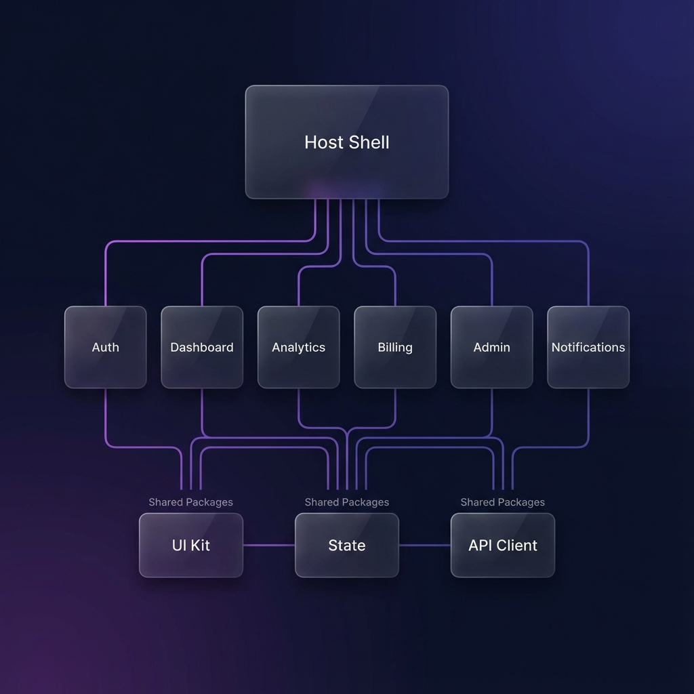

# 🌐 Micro Frontend Platform


> Enterprise-grade Micro Frontend Platform built with Next.js 15+, Module Federation, TypeScript, and Turborepo. Demonstrating architectural patterns used by AWS, Shopify, Uber, and Atlassian.

<p align="center">
  
</p>

## ✨ Features

- **🏗️ Module Federation** - Runtime integration of independent applications
- **📦 Monorepo Architecture** - Turborepo-powered workspace with optimized builds
- **🎨 Shared Design System** - Consistent UI components and design tokens
- **🔐 Unified Authentication** - Single sign-on across all micro frontends
- **📊 Independent Deployment** - Each micro frontend deploys independently
- **⚡ TypeScript First** - End-to-end type safety across applications
- **🧪 Comprehensive Testing** - 56+ unit tests, E2E with Playwright

## 🚀 Quick Start

```bash
# Clone the repository
git clone https://github.com/yourusername/micro-frontend-platform.git

# Install dependencies
npm install

# Run all applications in development mode
npm run dev:all
```

Then open [http://localhost:3000](http://localhost:3000) to see the platform.

## 📁 Project Structure

```
micro-frontend-platform/
├── apps/
│   ├── host/           # Main shell application (port 3000)
│   ├── auth/           # Authentication micro frontend (port 3001)
│   ├── dashboard/      # Dashboard micro frontend (port 3002)
│   ├── analytics/      # Analytics micro frontend (port 3003)
│   ├── billing/        # Billing micro frontend (port 3004)
│   ├── admin/          # Admin micro frontend (port 3005)
│   └── notifications/  # Notifications micro frontend (port 3006)
│
├── packages/
│   ├── ui-kit/         # Shared component library
│   ├── design-tokens/  # Design tokens (colors, spacing, etc.)
│   ├── shared-state/   # State management solution
│   ├── shared-utils/   # Utility functions
│   ├── api-client/     # API client for backend communication
│   └── config/         # Shared configuration
│
├── docs/               # Documentation
├── e2e/                # End-to-end tests
└── scripts/            # Automation scripts
```

## 🛠️ Tech Stack

| Category              | Technology                   |
| --------------------- | ---------------------------- |
| **Framework**         | Next.js 15+                  |
| **Language**          | TypeScript                   |
| **Module Federation** | @module-federation/nextjs-mf |
| **Monorepo**          | Turborepo                    |
| **Styling**           | CSS-in-JS, CSS Variables     |
| **State Management**  | Zustand                      |
| **Testing**           | Jest, Playwright             |
| **Package Manager**   | npm/pnpm                     |

## 🏛️ Architecture

```
┌─────────────────────────────────────────────────────────────────┐
│                         HOST SHELL                               │
│  ┌──────────────┬──────────────┬──────────────┬──────────────┐  │
│  │   Navigation │   Auth State │   Theme      │   Layout     │  │
│  └──────────────┴──────────────┴──────────────┴──────────────┘  │
└─────────────────────────────────────────────────────────────────┘
                              │
              ┌───────────────┼───────────────┐
              │               │               │
              ▼               ▼               ▼
     ┌──────────────┐ ┌──────────────┐ ┌──────────────┐
     │     AUTH     │ │  DASHBOARD   │ │  ANALYTICS   │
     │  ──────────  │ │  ──────────  │ │  ──────────  │
     │  • Login     │ │  • Widgets   │ │  • Charts    │
     │  • Register  │ │  • Cards     │ │  • Reports   │
     └──────────────┘ └──────────────┘ └──────────────┘
              │               │               │
              └───────────────┼───────────────┘
                              │
     ┌──────────────┐ ┌──────────────┐ ┌──────────────┐
     │   UI-KIT     │ │ SHARED-STATE │ │  API-CLIENT  │
     │  ──────────  │ │  ──────────  │ │  ──────────  │
     │  Components  │ │  Zustand     │ │  Axios       │
     └──────────────┘ └──────────────┘ └──────────────┘
```

## 📜 Available Scripts

| Command                        | Description                   |
| ------------------------------ | ----------------------------- |
| `npm run dev:all`              | Run all apps in parallel      |
| `npm run build`                | Build all packages and apps   |
| `npm run test`                 | Run all tests                 |
| `npm run lint`                 | Lint all packages and apps    |
| `npm run build:affected`       | Build only affected packages  |
| `npm run create:microfrontend` | Generate a new micro frontend |

## 🧪 Testing

```bash
# Run unit tests
npm test

# Run E2E tests
npx playwright test

# Run with coverage
npm run test:coverage
```

## 📊 Test Results

- **Unit Tests**: 56+ passing
- **E2E Tests**: Auth and homepage flows
- **TypeScript Coverage**: 100%

## 🚢 Deployment

### Vercel (Recommended)

Each micro frontend can be deployed to Vercel independently:

```bash
# Deploy host
cd apps/host && vercel

# Deploy auth
cd apps/auth && vercel
```

### Remote Registry

The host application loads remotes dynamically from a registry:

```json
{
  "auth": "https://auth.yourdomain.com/_next/static/chunks/remoteEntry.js",
  "dashboard": "https://dashboard.yourdomain.com/_next/static/chunks/remoteEntry.js"
}
```

## 📚 Documentation

- [Architecture Overview](./ARCHITECTURE.md)
- [Development Guide](./DEVELOPMENT.md)
- [Deployment Guide](./DEPLOYMENT_GUIDE.md)
- [Testing Guide](./TESTING.md)
- [Module Federation](./MODULE_FEDERATION.md)

## 🎯 What This Project Demonstrates

| Skill                   | Implementation                         |
| ----------------------- | -------------------------------------- |
| **System Architecture** | Enterprise-grade micro frontend design |
| **Monorepo Management** | Turborepo with shared packages         |
| **Module Federation**   | Dynamic runtime component loading      |
| **TypeScript Mastery**  | Full type safety across apps           |
| **Testing Strategy**    | Unit, integration, and E2E tests       |
| **CI/CD Knowledge**     | GitHub Actions pipelines (planned)     |
| **Documentation**       | Comprehensive guides and ADRs          |
| **Platform Thinking**   | Beyond components → ecosystem design   |

## 🤝 Contributing

Contributions are welcome! Please read our [Contributing Guide](./CONTRIBUTING.md) for details.

1. Fork the repository
2. Create your feature branch (`git checkout -b feature/amazing-feature`)
3. Commit your changes (`git commit -m 'Add amazing feature'`)
4. Push to the branch (`git push origin feature/amazing-feature`)
5. Open a Pull Request

## 📄 License

This project is licensed under the MIT License - see the [LICENSE](LICENSE) file for details.

## 🙏 Acknowledgments

- Inspired by enterprise micro frontend architectures at AWS, Shopify, and Uber
- Built with [Next.js](https://nextjs.org/) and [Module Federation](https://module-federation.io/)
- Powered by [Turborepo](https://turbo.build/)

---

<p align="center">
  Built with ❤️ by <a href="https://github.com/yourusername">Your Name</a>
</p>
