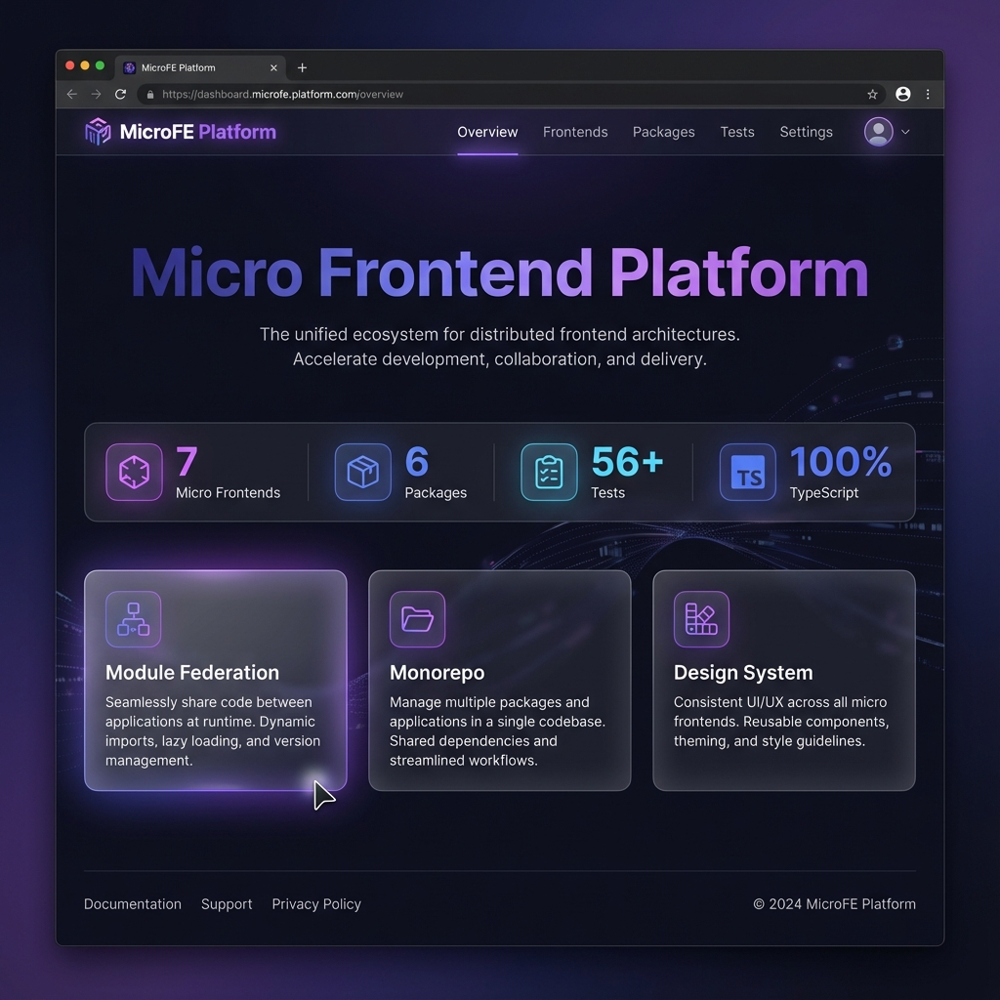

# 🌐 Micro Frontend Platform

[](https://github.com)
[](https://www.typescriptlang.org/)
[](https://github.com)
[](./LICENSE)
[](./CONTRIBUTING.md)

> 🏗️ Enterprise-grade Micro Frontend Platform built with **Next.js 15+**, **Module Federation**, **TypeScript**, and **Turborepo**. Demonstrating architectural patterns used by **AWS, Shopify, Uber, and Atlassian**.

<p align="center">
  
</p>

---

## ✨ Key Features

| Feature                   | Description                                       |
| ------------------------- | ------------------------------------------------- |
| 🏗️ **Module Federation**  | Runtime integration of independent applications   |
| 📦 **Monorepo**           | Turborepo-powered workspace with optimized builds |
| 🎨 **Design System**      | Shared UI components and design tokens            |
| 🔐 **Unified Auth**       | Single sign-on across all micro frontends         |
| 📊 **Independent Deploy** | Each micro frontend deploys separately            |
| ⚡ **TypeScript**         | End-to-end type safety (100% coverage)            |
| 🧪 **Testing**            | 56+ unit tests, E2E with Playwright               |

---

## 🏛️ Architecture

<p align="center">
  
</p>

```
┌─────────────────────────────────────────────────────────────────┐
│                         HOST SHELL                               │
└─────────────────────────────────────────────────────────────────┘
                              │
        ┌─────────────────────┼─────────────────────┐
        ▼                     ▼                     ▼
   ┌────────┐           ┌──────────┐          ┌───────────┐
   │  AUTH  │           │ DASHBOARD│          │ ANALYTICS │
   └────────┘           └──────────┘          └───────────┘
        │                     │                     │
   ┌────────┐           ┌──────────┐          ┌───────────┐
   │BILLING │           │  ADMIN   │          │  NOTIFS   │
   └────────┘           └──────────┘          └───────────┘
                              │
        ┌─────────────────────┼─────────────────────┐
        ▼                     ▼                     ▼
   ┌────────┐           ┌──────────┐          ┌───────────┐
   │ UI-KIT │           │  STATE   │          │API-CLIENT │
   └────────┘           └──────────┘          └───────────┘
```

---

## 🚀 Quick Start

```bash
# Clone the repository
git clone https://github.com/yourusername/micro-frontend-platform.git
cd micro-frontend-platform

# Install dependencies
npm install

# Run all applications
npm run dev:all
```

Open [http://localhost:3000](http://localhost:3000) to see the platform.

---

## 📁 Project Structure

```
micro-frontend-platform/
├── apps/
│   ├── host/           # Shell application (port 3000)
│   ├── auth/           # Authentication (port 3001)
│   ├── dashboard/      # Dashboard (port 3002)
│   ├── analytics/      # Analytics (port 3003)
│   ├── billing/        # Billing (port 3004)
│   ├── admin/          # Admin (port 3005)
│   └── notifications/  # Notifications (port 3006)
│
├── packages/
│   ├── ui-kit/         # Component library
│   ├── design-tokens/  # Design variables
│   ├── shared-state/   # State management
│   ├── shared-utils/   # Utilities
│   ├── api-client/     # API client
│   └── config/         # Configuration
│
├── docs/               # Documentation
└── e2e/                # E2E tests
```

---

## 🛠️ Tech Stack

<p align="center">
  
  
  
  
</p>

| Category          | Technology                              |
| ----------------- | --------------------------------------- |
| Framework         | Next.js 15+ with Pages Router           |
| Language          | TypeScript (strict mode)                |
| Module Federation | @module-federation/nextjs-mf            |
| Monorepo          | Turborepo                               |
| State Management  | Zustand                                 |
| Testing           | Jest, React Testing Library, Playwright |
| CI/CD             | GitHub Actions                          |
| Deployment        | Vercel                                  |

---

## 📜 Scripts

| Command                        | Description                 |
| ------------------------------ | --------------------------- |
| `npm run dev:all`              | Run all apps in parallel    |
| `npm run build`                | Build all packages and apps |
| `npm test`                     | Run unit tests              |
| `npx playwright test`          | Run E2E tests               |
| `npm run lint`                 | Lint all packages           |
| `npm run create:microfrontend` | Generate new micro frontend |

---

## 🧪 Testing

```bash
# Unit tests
npm test

# E2E tests
npx playwright test

# Coverage report
npm run test:coverage
```

**Test Results:** 56+ unit tests passing

---

## 📚 Documentation

- [Architecture Overview](./ARCHITECTURE.md)
- [Interview Guide](./INTERVIEW_GUIDE.md)
- [Contributing](./CONTRIBUTING.md)
- [Module Federation](./docs/MODULE_FEDERATION.md)
- [Testing Guide](./docs/TESTING.md)

---

## 🎯 What This Demonstrates

| Skill                 | Implementation                         |
| --------------------- | -------------------------------------- |
| **System Design**     | Enterprise micro frontend architecture |
| **Monorepo**          | Turborepo with shared packages         |
| **Module Federation** | Dynamic runtime loading                |
| **TypeScript**        | 100% type coverage                     |
| **Testing**           | Unit + E2E testing pyramid             |
| **CI/CD**             | GitHub Actions pipeline                |
| **Documentation**     | Comprehensive guides                   |

---

## 🤝 Contributing

Contributions welcome! See [CONTRIBUTING.md](./CONTRIBUTING.md) for guidelines.

---

## 📄 License

MIT License - see [LICENSE](./LICENSE) for details.

---

<p align="center">
  Built with ❤️ using Next.js, Module Federation & Turborepo
</p>
